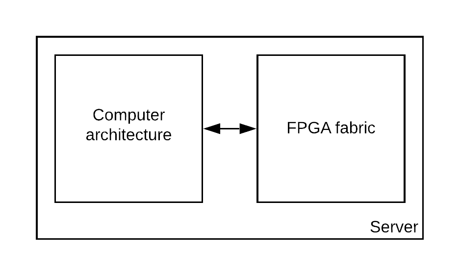
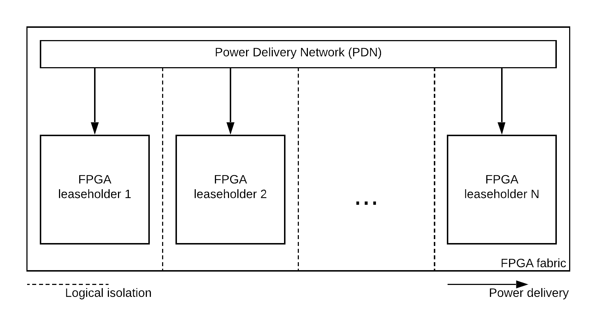

# SCA Framework
## "program and play" framework for side-channel attacks

### Topic overview

FPGA devices are subject to a significant popularity increase especially thanks to the increasing number of IoT objects and the need of faster computation despite the end of Moore's law.

Today, servers can embed FPGA based hardware accelerators. These are often cryptographic accelerators. This allows a better response time for server when establishing a secure connection with a client. 

  

As the servers access are already shared among multiple users, shared FPGA fabric access are studied in order to allow the implementation of multiple accelerators into the same servers, improving the response time for all the client of a server.

Although logical isolation can be perform into the FPGA fabric to forbid users access to each other logic (the same way it is done with containerization on servers), it is significantly more difficult to provide power isolation.

In this context, we attempt to demonstrate that it is possible to perform a Side-Channel Attack (SCA) using Correlation Power Analysis (CPA).

To achieve our goal, we designed a hybrid framework that allows to simulate our SCA attacks on a majority of hybrid FPGA development boards and retrieve results on a personal computer.

The framework consist on a test bench FPGA platform and an configure and run application.

### Introduction

This repository provides an open-source framework containing a VHDL hardware wrapper and a C application to drive the wrapper.

#### Contents

The repository is organized as follows :
- **cmd_sca**:  C command prompt to drive the hardware platform
- **vivado_sca**: Vivado project for the hardware SCA test-bench
- **platform_sca**: C Vitis/SDK platform project

### Usage

To get started with the framework check the [getting started guide]. If you are already familiar with Vivado and Vitis/SDK you can directly get deep into the [attack documentation].

### Documentation

Since this framework is part of a complete research project, not only code documentation is provided but we also provided a more general technical documentation.

#### Internal documentation

this repository features a wiki with technical documentation containing:
- Code documentation
- Attack documentation
- Hardware documentation 

#### Side channel attacks

The following research papers describes and experiment side channels attacks:
- [link to the papers]

#### FPGA based sensors

The following research papers describes and experiment FPGA based sensors:
- [link to the papers]

#### Remote FPGA

The following research papers describes and experiment the remote FPGA and collocation possibilities
- [link to the papers]
