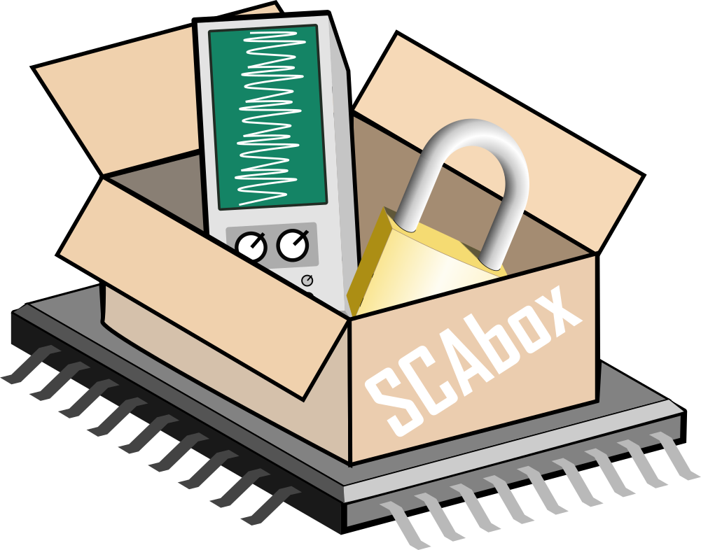

Welcome to SCAbox's documentation !
***************************************************************

SCAbox is an FPGA-based side-channel analysis framework dedicated to research and educational purposes. 

SCAbox aims at popularizing hardware security by enabling  SCA  experiments at low-cost using software-based hardware attacks. With the SCAbox framework you will be able to:

- **Familiarize** with SCA and co-design development.
- **Reproduce** attacks conducted in recent academic papers.
- **Build** your own FPGA-based side-channel sensors.
- **Characterize** the SCA leakage of your hardware and software algorithm implementation

For more information please check out our paper introducing SCAbox: PAPER_PATH

Content
---------------------------------------------------------------

This website contains all the tutorials required to set up the SCAbox framework.

- Please follow the demonstration (Tuto#1) to get an overview of the SCAbox capabilities.
- Please follow the advanced tutorials (Tuto #1, #2 and #3) to build and custom the framework. 

.. toctree::
   :maxdepth: 2
   :caption: Tutorials

   tuto/home

.. toctree::
   :maxdepth: 2
   :caption: Wiki

   wiki/home
   
Cite
---------------------------------------------------------------

Anonymous