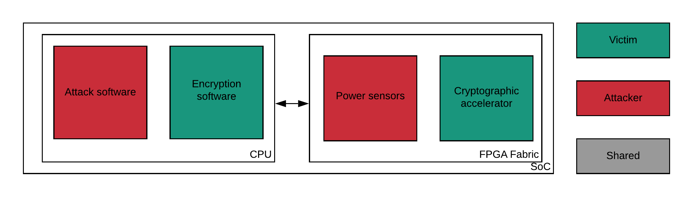
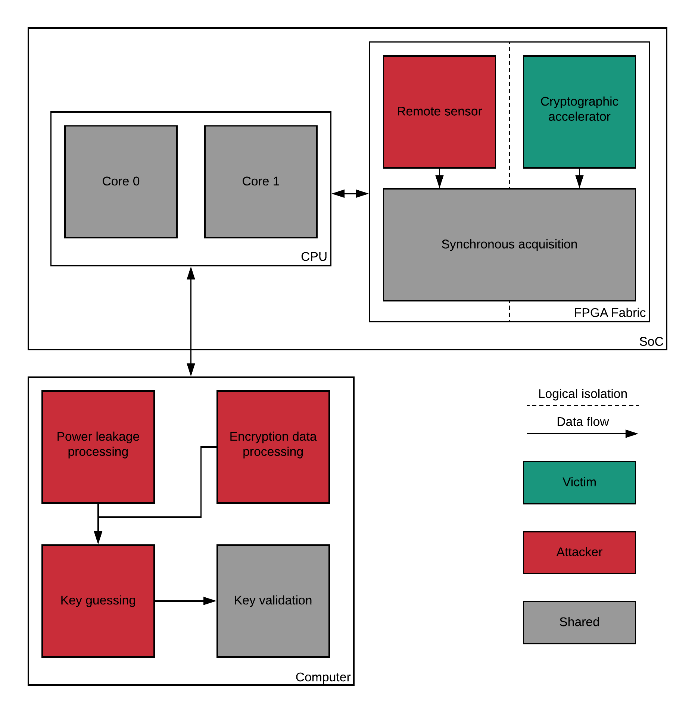

Fundamentals
***************************************************************

We are interested in side-channel attacks based on the power consumption of an SoC.
For most of these attacks we can identify common steps :

1. *Acquire* the power leakage of crypto-algorithm running
2. *Model* the power leakage for various key *hypothesis*
3. *Correlate* the *observed power leakage* to the *modeled power leakage*
4. *Iterate* the previous steps for until the correlation is significant

Our attack approach is based on the Correlation Power Analysis (CPA).
Therefore, the correlation is computed using Pearson's coefficient defined by :

.. math::
   \rho_{X, Y} = \dfrac{E[X-\mu_X] E[Y-\mu_Y]}{\sigma_X \sigma_Y}

Where :math:`X` is the instantaneous observed power leakage random variable and :math:`Y` the instantaneous modeled power leakage.
:math:`\mu` denotes the sample mean, :math:`\sigma` the sample standard deviation and :math:`E` the expectation and a random variable. 

The Pearson's coefficient's value is in the interval :math:`[-1, 1]`. 
A negative correlation denotes a inverse linear dependency between :math:`X` and :math:`Y`. 
A positive correlation denotes a direct linear dependency and a correlation near zero indicates that the two variables are not linearly correlated. 

The correlation coefficient depends on time :math:`\rho_{X, Y} = \rho_{X, Y}(t)`.
It is computed all along the leakage signals and will peak at a given instant if a strong guess is made as shown in the graph bellow.

.. image:: media/img/sca_pearson.png
   :width: 640
   :alt: Pearson coefficient
   :align: center

We consider that the correlation coefficient indicates how good our key hypothesis was.
More precisely, we state that if the best absolute value of the coefficient is :math:`N` times greater than the second best absolute correlation,
the attack is successful. The value :math:`N` is arbitrary. 

Otherwise, we acquire more power leakage data in order to obtain a better correlation.
A significant amount of power leakage data is necessary to obtain a determinant correlation.

In the case of an AES algorithm on 128 bit data, it leads to a key browsing among :math:`256 \cdot 16` possible values. 
In contrast, an explicit brute force attack in the same conditions would require a key exploration in the :math:`2^{128}` possible values of the key.
This attack method can be characterized as a *divide and conquer* key inference, we divide the key into multiples part easy to attack as shown in the figure below.

.. image:: media/img/sca_aes_guess.png
   :width: 640
   :alt: AES Guess Key
   :align: center

It is not always possible to retrieve the hole key with a side-channel attack. According to the chosen model, only several bits can be guessed correctly.

Victims
***************************************************************

The victims of such a side-channel attack are all the electronic devices that are not protected against power leakages.
Since we are performing remote side-channel attacks using FPGA our victim we preferentially will be servers provided
with an FPGA fabric that can be shared among multiple servers users.

FPGA based remote-sensors are employed in the framework to eavesdrop the power leakage of 
a crypto-algorithm running in the SoC.

Therefore, at least two types of targets are sensitive to our attack, the *CPU* and the *FPGA accelerators* as shown in the figure below.

In the first case, the power leakage of the CPU is leveraged. This leakage contains among a lot of noise due to the CPU activity,
the information on the crypto-algorithms running.

In the second case, the power leakage of the fabric is leveraged, This leakage is much more significant because the electrical activity
is more intense than CPU's one when crypto-algorithms are running.

The complete attack model is illustrated in the figure bellow :

Assumptions 
***************************************************************

Side-channel attacks works only under several assumptions :

a. Attacker and victim share the same FPGA fabric
b. Attacker and victim shares the same CPU
c. The key remains the same during all the leakage acquisition

Since we attempt to demonstrate the abilities of side-channel attacks, we will not consider the triggering issues.
We will assume that the attacker is able to synchronously trigger leakage acquisition with the victim crypto-computations.

Our Setup
***************************************************************

Stages
---------------------------------------------------------------

In order to standardize the stages of a side-channel attack we defined a procedure called the *attack pipeline*.
It consists on several steps that will allow to manually or programmatically reproduce this attack.
The procedure works for all targets under the assumptions provided above :

1. Launch sensors acquisition and crypto-algorithm
2. Wait until crypto-algorithm end
3. Stop sensors acquisition
4. Send data via serial port
5. Acquire data
6. Correlate data
7. Guess the key

Architecture
---------------------------------------------------------------

In order to perform successfully the pipeline, we designed an hybrid architecture that simulates the remote side-channel attack setup.
Our architecture is made to reproduce attacks and to be flexible, the goal being for users to customize the attack bench.
We can split the bench into different parts located on the SoC :

- Acquisition control : handle sensors acquisition
- Sensors : capture power leakage
- Victim : perform cryptographic computation

The figure below detail how our architecture implement the attack pipeline :

The acquisition controller is shared so the leakage is captured synchronously with the crypto-algorithm run.
This allows to have consistent data among the iterations.

The cores are considered shared even if they can be completely owned by the attacker or the victim.
In our most simple configuration, one core is used both as a victim, performing crypto-computation, and as an attacker, communicating leakage and encryption data.
More sophisticated configurations separates attacker and victim cores in order to produce a more realistic leakage.

Lastly, the key validation part allows to verify if the attack guess was correct by comparing the original key with the guessed one, which can be performed only
if the attacker is provided with the correct key in advance.

